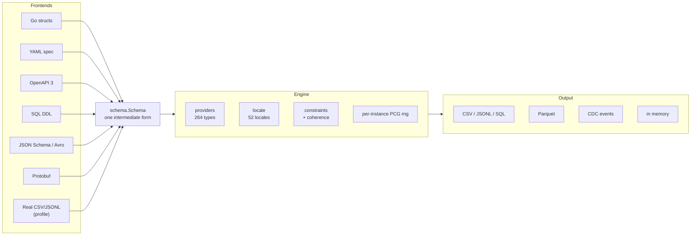
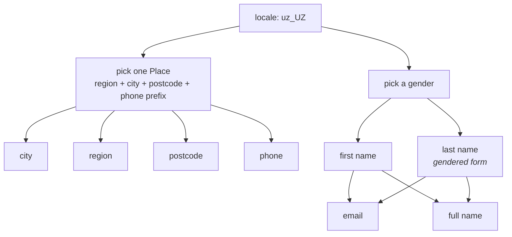
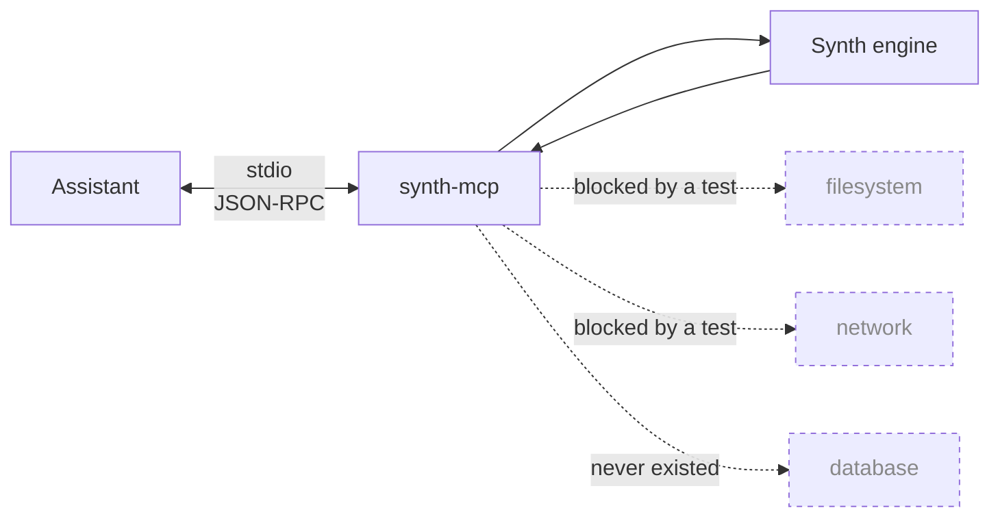
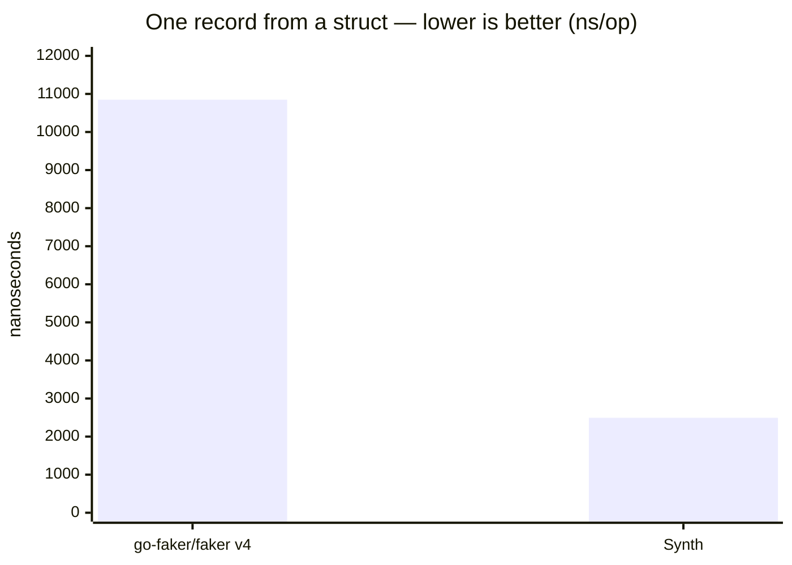
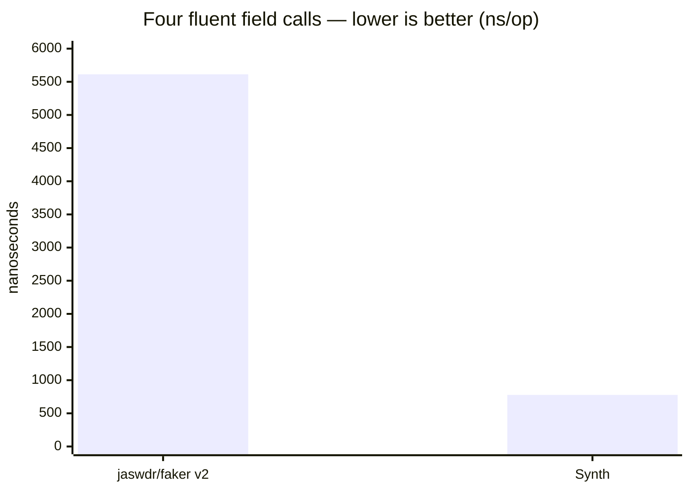
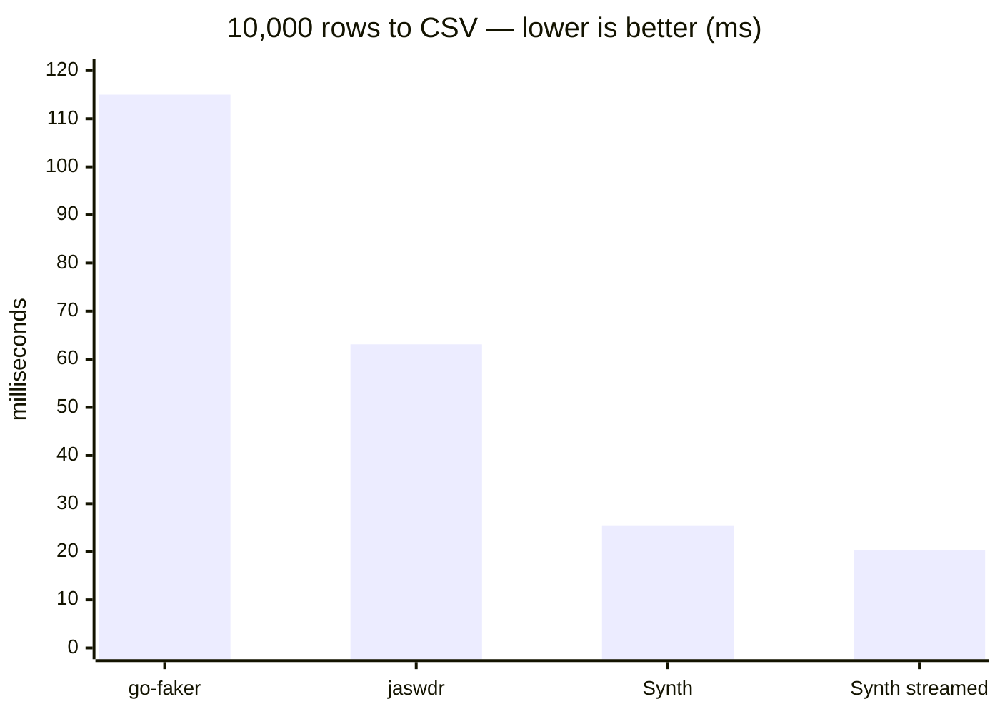
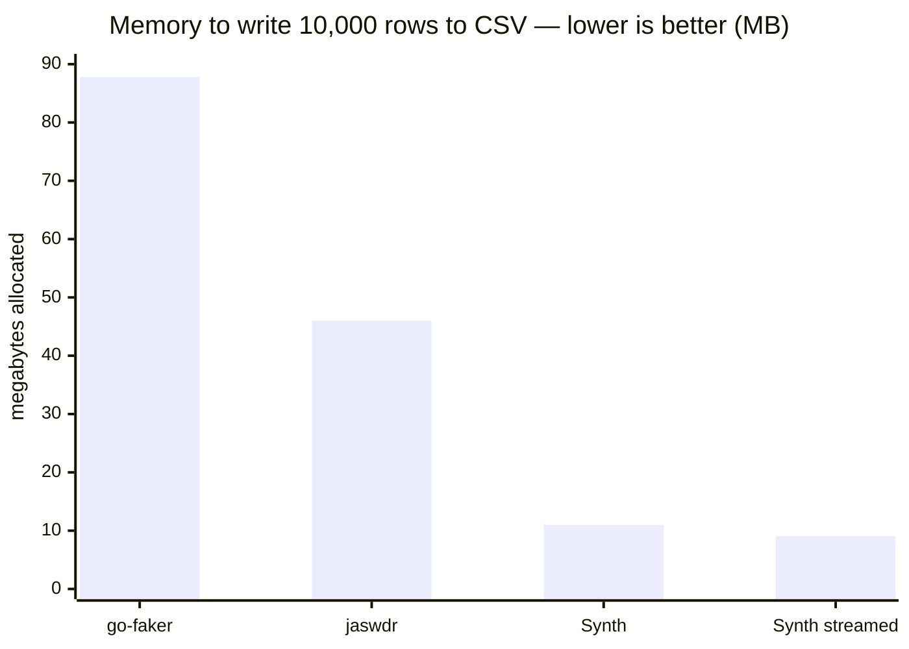
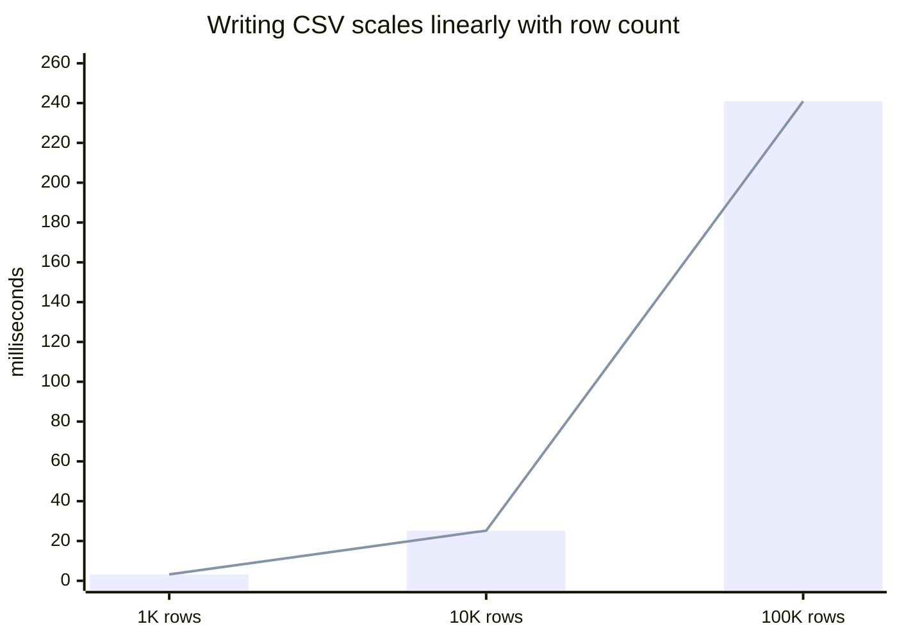
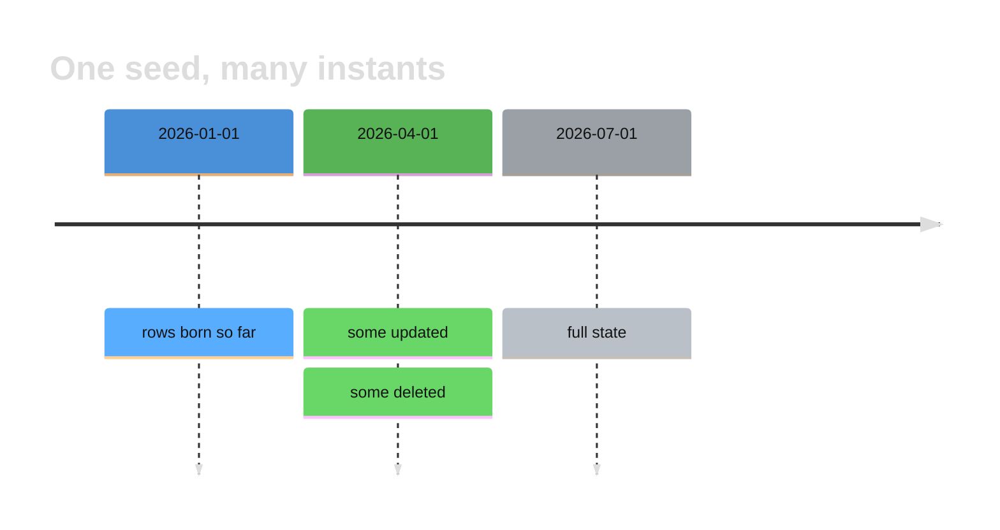

# Synth


**Fakers give you random strings. Synth gives you a dataset that holds together.**

A user's email matches their name. A transaction points at a real account, in that account's currency, with a timestamp after the account was opened. Every card passes Luhn, every IBAN passes its checksum. That's the difference: fakers generate *fields*, Synth generates *records that reference each other* — at millions of rows per run, streamed, in constant memory.

Synth generates *realistic*, locale-aware data — users, payments, transactions, business records — instead of random fake values. It streams millions of records to CSV, JSONL, SQL `INSERT` files, or Parquet with minimal memory usage, and can produce valid request payloads from OpenAPI schemas.

## How it differs from a faker

| | Faker libraries | Synth |
| --- | --- | --- |
| Scope | one field at a time | whole records, with relations between them |
| Consistency | `Name()` and `Email()` are unrelated | email derives from the name, city matches the postcode |
| Validity | random digits | Luhn-valid cards, checksum-valid IBANs, real BIN ranges |
| Volume | build a slice in memory | streamed, constant memory at 100M+ rows |
| Output | strings you wire up yourself | CSV, JSONL, SQL, Parquet, CDC files |
| Schemas | none | generates valid payloads from your OpenAPI spec |

## How it fits together

Every input format becomes the same intermediate schema, so a feature written
once — coherence, constraints, masking — works no matter where the schema came
from. Adding a frontend costs one parser and nothing else.



## Features

### Referential integrity
Records are generated as a graph, not a list. Declare a relation once and every child row points at a parent that actually exists.

```go
users := synth.Users(10_000)
synth.Orders(500_000, synth.BelongsTo(users, "user_id"))
```

Foreign keys resolve. Cardinality is controllable (`OneToMany`, `Weighted`). Load the exported parent table into Postgres with your own loader and the child table's FK constraints pass on the first try.

Keys resolve across runs too, not only within one process. Generate the parent
today, the child next week, and point the child at the keys already on disk:

```sh
synth gen -s users.yaml  -o users.csv  -n 10000
synth gen -s orders.yaml -o orders.csv -n 500000 --fk user_id=users.csv:id
```

And `--append` extends a dataset without regenerating it — a sidecar tracks how
much exists so the new rows never repeat the old ones or their primary keys:

```sh
synth gen -s users.yaml -o users.csv -n 1000000 --append   # a million more, no collisions
```

### Temporal causality
Timestamps aren't random points in a range — they respect the order events can happen in. An order is `created → paid → shipped → delivered`, each strictly after the last, with realistic gaps. Accounts are never used before they're opened, and refunds never precede their charge.

```go
synth.Orders(1_000, synth.Timeline("2026-01-01", "2026-07-01"), synth.Lifecycle(synth.OrderFlow))
```

### Format-valid values
Every generated identifier passes the check a real system would run on it:

- Credit cards — Luhn-valid, issued from real BIN ranges per brand
- IBANs — mod-97 checksum, correct per-country length and BBAN layout
- National IDs, VAT numbers, tax IDs — country-specific check digits
- Emails, URLs, phone numbers — RFC / E.164 conformant

### Locale coherence
Locale isn't just a name list. Pick `uz_UZ` and you get Uzbek names, `+998` phone numbers, Tashkent districts, UZS amounts, and postcodes that match the city they're attached to — consistently across every field of the record.

One struct, one seed, three locales — name, phone, card and the nested address
all move together ([examples/localize](examples/localize)):


All 52 locales carry at least **1000 distinct full-name combinations per
gender**, drawn from real names in the language's own script. Male and female
lists are kept apart, and where surnames inflect for gender the correct form is
used: Novák/Nováková, Иванов/Иванова, Bērziņš/Bērziņa, Abdullayev/Abdullayeva.
Tests enforce the cardinality, the script and the inflection — each is the kind
of error that is invisible to a reader who does not speak the language and
glaring to one who does.

Ten locales also carry their own **catalog** datasets — weekdays, months,
seasons, weather, colours, dishes, fruit, vegetables, drinks and animals — in
the local language, and with local content rather than translations: `uz_UZ`
returns osh and somsa, `pl_PL` returns pierogi and żurek. Types with no dataset
for the chosen locale fall back to English rather than returning nothing.

That fallback is stated, not hidden. `providers.LocalesFor(kind)` reports
exactly which locales a type has data for, the workbench shows it on every
type in the palette, and a test asserts that a type like `superhero` — the
same word everywhere — never claims coverage it does not have.

A single column can step out of the locale with `localize=false`, without
dragging the rest of the dataset back to English with it:

```go
type Order struct {
    Customer string `synth:"name"`                     // Uzbek
    City     string `synth:"city"`                      // Tashkent district
    Category string `synth:"productcategory,localize=false"` // English, for the partner's system
}
```

The switch only bites on kinds a locale actually reaches — names, addresses,
phone, currency, national IDs, and the catalog types with per-locale data.
`providers.Localizable(kind)` answers whether a kind is one of them, and
`providers.LocalizableKinds()` lists them all; on anything else `localize=` is a
no-op because there was never anything locale-specific to turn off. A
de-localized address field still agrees with its de-localized neighbours: they
share one `en_US` place, so the city still matches the postcode.

Within one record the choices are not independent. A single `locale.Place` is
drawn first, and every place-derived field reads from it — which is why the city
matches the postcode instead of merely both being Uzbek.



### Statistical shape
Real data isn't uniform. Synth draws from distributions so your test data stresses the same paths production does.

Via tags:

```go
type Txn struct {
    Amount   float64 `synth:"amount,dist=lognormal,mu=10,sigma=1"` // long tail
    Status   string  `synth:"enum,choices=settled|pending|failed,weights=0.94|0.05|0.01"`
    Category string  `synth:"enum,choices=a|b|c|d,dist=zipf,s=1.2"` // hot keys
}
```

Or in code:

```go
synth.Make[Txn](1_000_000, synth.Weighted("Status", map[string]float64{
    "settled": 0.94, "pending": 0.05, "failed": 0.01,
}))
```

Distributions: `normal`, `lognormal`, `exp` (numeric fields) and `zipf` /
explicit `weights` (enums).

Long tails, hot keys, and skew are what break partitioning and query planners — uniform fakers never surface those bugs.

### Correlated fields and time series
Numeric columns don't have to be independent. `derive` makes one a linear
function of another in the same row, so a scatter plot has a shape instead of a
cloud:

```yaml
age:    { kind: int, min: 25, max: 65 }
income: { kind: float, derive: age, slope: 1200, intercept: 20000, noise: 0.1 }
```

And `kind: timeseries` makes a column follow a curve over time — trend plus a
seasonal cycle plus noise — for metrics and IoT data:

```yaml
ts:  { kind: time, min: 2026-01-01T00:00:00Z, max: 2026-02-01T00:00:00Z }
cpu: { kind: timeseries, axis: ts, base: 40, trend: 0.5, amplitude: 20, period: 24h, noise: 3, min: 0, max: 100 }
```

Both are pure functions of the same row, so they generate in the same
streaming, deterministic pass as everything else.

### Constant-memory streaming
Records are pushed through a pipeline, never accumulated. Generating 100M rows uses the same memory as generating 1K. Generation is sharded across cores, and sinks batch and backpressure independently.

### Deterministic and reproducible
A seed fully determines the output. The same seed produces byte-identical data across runs, machines, and Go versions — so a failing CI run is reproducible locally, and golden-file tests stay stable.

```go
synth.Make[User](1000, synth.WithSeed(42))
```

Each record is seeded independently from the base seed, so parallel generation is byte-identical to serial output.

### Schema-driven generation
Point Synth at a schema instead of hand-writing generators:

- **OpenAPI** — valid request bodies for every endpoint, respecting `format`, `pattern`, `enum`, `minimum`, and `required`
- **SQL DDL** — read `CREATE TABLE`, infer types, honor `NOT NULL`, `UNIQUE`, `CHECK`, and FK constraints
- **Go structs** — generate from your existing domain types via tags

### Test-ready outputs
CSV, JSONL, SQL `INSERT` files, Parquet, Postgres `COPY` files, and
Debezium-shaped CDC events — every one of them a file. Synth never opens a
database or network connection; handing the file to your loader is the last
step, and it is yours.

For bulk loading, `COPY` is what Postgres wants — an `INSERT` per row is the
slowest path the server offers:

```sh
synth gen -s users.yaml -n 100000000 -o users.pgbin   # binary COPY
synth gen -s users.yaml -n 100000000 -o users.pgcopy  # text COPY
```

Both write a matching `CREATE TABLE` next to the data as `users.pgbin.sql`.
That pairing is not a convenience: binary `COPY` carries no type names, so the
table's column types are what the server decodes the bytes as, and a table
built by hand that differs in one column means a rejected file. Synth generates
the DDL and the encoding from the same type table, so they cannot disagree.

```sh
psql -f users.pgbin.sql
```

Large outputs compress on the way out — name the file and Synth does the rest:

```sh
synth gen -s users.yaml -n 100000000 -o users.jsonl.zst
synth gen -s users.yaml -n 100000000 -o users.csv.gz
```

### Edge-case injection
Testing the happy path is the easy part. Ask for the values that break parsers: unicode names, emoji, RTL text, empty strings, boundary numerics, nulls in nullable columns.

```go
synth.New(synth.WithChaos(0.02))   // 2% of records carry a nasty value
```

## Try it without installing anything

**[bakhod1r.github.io/synth](https://bakhod1r.github.io/synth)** — the workbench
with the generator compiled to WebAssembly.

It is the same page and the same engine as `synth ui`; only the backend differs,
and the page's JavaScript is byte-identical between them. Nothing is uploaded,
because there is nowhere to upload it to — the generator runs in your tab. That
is a stronger claim than a promise not to send your schema anywhere, and it is
the whole reason the demo is built this way rather than hosted.

About 1.6 MB to download, once.

## Browser workbench

```bash
synth ui            # then open http://127.0.0.1:8080
```

A local page with the type palette on the left, the schema in the middle, and a
live preview on the right that regenerates as you type. The seed is shown and
editable, because reproducibility is the thing a hosted generator cannot give
you — the UI teaches it rather than hiding it.

The palette is read from the provider registry itself, so it cannot drift from
what the engine actually supports, and each type is marked with whether its
values really follow the locale. Most do not, and saying so beats letting you
assume otherwise.

**The server binds `127.0.0.1` and refuses anything else** — `Serve("0.0.0.0:8080")`
returns an error, and a test enforces it. The page is embedded in the binary
with inline CSS and JavaScript: no CDN, no fonts, no telemetry, no outbound
request of any kind, and a test asserts the page contains no external origin.
The browser connects in; Synth never connects out.

## MCP

Synth speaks MCP, so an assistant can generate and check data without shelling
out to the CLI:

```bash
go install github.com/bakhod1r/synth/mcp/cmd/synth-mcp@latest
claude mcp add synth -- synth-mcp
```

Eight tools: `generate`, `list_types`, `list_presets`, `verify`, `profile`,
`mask`, `snapshot`, `diff`.

The server is stdio-only and takes every input as an argument rather than a
path — it opens no socket and reads no file, and a test forbids the imports that
would let it. An MCP server runs with your permissions on behalf of a model that
may be reading text someone else wrote, so a path argument would turn a data
generator into a file-reading primitive. See [mcp/README.md](mcp/README.md).



Data goes in as an argument and comes back in the response. Nothing else moves.

It is a separate module: `mcp-go` brings 20 transitive dependencies, kept out of
the core module's graph.

## Install

```bash
go get github.com/bakhod1r/synth              # library
go install github.com/bakhod1r/synth/cmd/synth@latest   # CLI
npm install @bakhod1r/synth                   # JavaScript, via WebAssembly
```

## Quick start

Synth is a **pure data provider**: it never connects to a database, never runs
`INSERT`, never reads DDL. You hand it a plain Go struct; it hands you coherent
records — in memory, to a file, or streamed. Loading is a separate tool's job.

```go
package main

import (
	"time"

	"github.com/bakhod1r/synth"
	"github.com/google/uuid"
)

type User struct {
	ID        uuid.UUID `synth:"pk"`
	FirstName string
	Email     string `synth:"email,from=FirstName"` // derived from the name
	Phone     string
	Country   string
	Region    string
	City      string
	Postcode  string // stays coherent with Country/Region/City
	Card      string `synth:"card"` // Luhn-valid HUMO/UZCARD
	CreatedAt time.Time
}

func main() {
	// Tags are optional — untagged fields are inferred from name and type.
	users := synth.Make[User](10_000, synth.WithSeed(42), synth.WithLocale("uz_UZ"))

	synth.WriteCSV("users.csv", users)                       // to a file
	synth.Stream[User](1_000_000).ToJSONL("users.jsonl")     // constant memory
}
```

### Referential integrity

```go
users  := synth.Make[User](10_000, synth.WithSeed(1))
orders := synth.Make[Order](500_000, synth.Ref(users, "UserID")) // every FK is real
```

### Temporal causality

Timestamps respect the order events can happen in — a record's lifecycle stays
consistent instead of scattering random points in a range.

```go
type Order struct {
    CreatedAt   time.Time
    PaidAt      time.Time `synth:"time,after=CreatedAt,gap=1h..48h"`
    ShippedAt   time.Time `synth:"time,after=PaidAt,gap=1h..72h"`
    DeliveredAt time.Time `synth:"time,after=ShippedAt,gap=1h..120h"`
}
// CreatedAt < PaidAt < ShippedAt < DeliveredAt, always.
```

### Fluent single values

```go
g := synth.New(synth.Config{Seed: 42, Locale: "uz_UZ"})
g.Name()      // "Azizbek Karimov"
g.Phone()     // "+998901234567"
g.Card()      // Luhn-valid
g.Amount(1000, 500000)
```

## Benchmarks

Measured on Apple Silicon (M-series, 8 cores), Go 1.25, `go test -bench -benchmem`.
Each library fills the same four fields (name, email, phone, city).

**Struct filling** — one record from a struct definition:

| Library | ns/op | B/op | allocs/op |
| --- | --- | --- | --- |
| `go-faker/faker` v4 | 10,848 | 8,778 | 116 |
| **Synth** | **2,494** | **2,001** | **34** |



**Per-field calls** — the fluent API:

| Library | ns/op | B/op | allocs/op |
| --- | --- | --- | --- |
| `jaswdr/faker` v2 | 5,612 | 4,533 | 61 |
| **Synth** | **778** | **222** | **14** |



**Batch generation** — Synth's normal mode, where schema work is done once for
the whole run: 1,678 ns/record (~596K records/sec single-threaded), and
~1.28M records/sec across 8 cores with `MakeParallel`.

**Writing a file** — 10,000 rows to disk, the same four fields. This is what the
libraries are actually used for, and it is where the comparison changes shape:
go-faker and jaswdr generate values and stop, so their users write the loop by
hand. That loop is included below, because leaving it out would compare Synth's
whole job against half of theirs.

| Library | Format | ms/op | B/op | allocs/op |
| --- | --- | --- | --- | --- |
| `go-faker/faker` v4 | CSV (hand-written loop) | 115.0 | 87.8 MB | 1,160,247 |
| `jaswdr/faker` v2 | CSV (hand-written loop) | 63.1 | 46.0 MB | 620,393 |
| **Synth** | **CSV** | **25.5** | **11.0 MB** | **320,051** |
| **Synth** | **CSV, streamed** | **20.4** | **9.1 MB** | **300,036** |
| `jaswdr/faker` v2 | JSONL (hand-written loop) | 96.4 | 46.7 MB | 627,708 |
| **Synth** | **JSONL** | **50.1** | **9.6 MB** | **270,060** |
| **Synth** | **SQL INSERT** | **57.2** | **13.1 MB** | **400,058** |



Allocation is the wider gap, and the one that decides whether a run finishes:



The streamed row is the one that matters at scale: it never holds the rows in
memory, so its footprint does not grow with the row count. At ten thousand rows
the gap is small; the same code writes ten million.

Writing scales linearly — 1K/10K/100K rows take 3.2 ms, 25.2 ms and 240.9 ms:



```
BenchmarkSynth_WriteCSVScaling/1000        3,204,250 ns/op     1.1 MB/op
BenchmarkSynth_WriteCSVScaling/10000      25,161,486 ns/op    11.0 MB/op
BenchmarkSynth_WriteCSVScaling/100000    240,948,389 ns/op   109.8 MB/op
```

A note on presets: `synth gen --preset user` generates about 5,000 rows/sec,
which looks slow next to the numbers above. 96% of that time is one column —
`password_hash` runs PBKDF2 at 1,000 iterations, which is a key derivation
function and is meant to be expensive. The same shape without it runs at roughly
500,000 rows/sec.

Reproduce with `cd benchcmp && go test -bench=. -benchmem -run=^$ .`
(the comparison lives in its own module, so the competing fakers never enter
this library's dependency graph).

Per-instance RNG means no global-`rand` mutex — parallel generation scales, and
same-seed output is byte-identical regardless of worker count.

## Data domains

| Domain | Examples |
| --- | --- |
| People | name, email, phone, address, national ID |
| Payments | card, IBAN, merchant, currency, amount |
| Transactions | ledger entries, timestamps, statuses |
| Business | companies, invoices, orders, inventory |

## Learn from real data (profiling)

Point Synth at an **export** of a real table and it learns the shape — column
types, numeric ranges, null rates, and the real frequency of each category —
then generates synthetic rows that behave the same. Synth never connects to
your database; you produce the sample yourself:

```bash
psql -c "\copy (SELECT * FROM users LIMIT 10000) TO 'sample.csv' CSV HEADER"
```

```go
p, _ := synth.Profile("sample.csv")
rows, _ := p.Generate(1_000_000)   // same distribution, none of the real data
```

Low-cardinality columns keep their observed split (e.g. 80% active / 15%
inactive / 5% banned). Identifier-like columns are never echoed back, so real
values cannot leak into the output.

## Learned invariants (constraint mining)

Per-column profiling learns what each column looks like. It cannot see that a
`total` must agree with its line items, or that a refunded order must carry a
refund timestamp. `synth profile` mines those cross-column invariants from the
sample and writes them into the spec:

```yaml
constraints:
  - {kind: sum, parts: [subtotal, tax], whole: total}    # held over 48,912 rows
  - {kind: ordering, left: created_at, right: updated_at}  # held over 50,000 rows
  - {kind: implication, when: status, equals: "refunded", then: refund_at, exclusive: true}
```

Generation then enforces them. A total is **derived** from its parts rather
than generated independently; an out-of-order timestamp pair is swapped, which
preserves both values and their distribution instead of piling duplicates up at
a boundary.

Mining is conservative on purpose. A candidate is generated, then falsified
against the whole sample; an implication additionally needs a trigger group of
real size, and needs its target column to be empty *somewhere else* — otherwise
the column is simply always populated and the trigger has nothing to do with
it. Each surviving rule records how many rows it held over, so you can judge
it rather than trust it.

If a spec's constraints contradict each other, `Generate` returns an error
naming the unsatisfiable one. Emitting rows that quietly violate the spec would
be worse than failing: the data would look authoritative and be wrong.

## Audit an existing dataset (`synth verify`)

The rules that make Synth's output coherent are the rules worth checking on
data somebody else produced. `synth verify` is the generator run backwards:

```bash
synth verify -i orders.csv --ref user_id=users.csv:id
synth verify -i orders.csv -s orders.yaml -f json   # also re-check mined invariants
```

It reports failed check digits (Luhn, IBAN mod-97, EAN-13/UPC), unparseable
emails, URLs and IP addresses, dangling foreign keys, timestamp pairs in the
wrong order, and columns that carry no information. Parent tables are read from
their own files — nothing is queried.

Exit code 1 on any error, 0 when only warnings were found, so it drops into CI
without a wrapper. A degenerate column is a *warning*, not an error: real data
sometimes looks like that, and a tool that cries wolf gets muted.

Two rules keep it honest. A column is audited only when its values already
mostly match what its name claims, so a column called `card` holding loyalty
tiers is skipped rather than reported a million times. And a clean dataset must
produce an **empty** report — a check that fires on correct data is a false
positive and a bug here, not something for you to filter out.

## Compare two datasets' shape (`synth diff`)

After changing a generator, or to guard a real feed against drift, `synth diff`
answers whether two files are shaped alike — columns, types, numeric ranges,
null rates, category sets — without comparing rows:

```sh
synth diff baseline.csv candidate.csv
synth diff baseline.csv candidate.csv --tolerance 0.2 -f json   # for CI
```

A column added, removed or retyped is an **error**; a range, null rate or
category set that moved past tolerance is a **warning**. Exit code 1 on any
error, 0 on warnings only — same contract as `verify`, so a pipeline fails on a
structural break and passes on ordinary drift. The MCP server exposes the same
as a `diff` tool over inline datasets.

## Anonymize a production dump (GDPR)

Hand Synth a real export and get one that is safe to share: personal data is
replaced with synthetic values of the same format, everything else is left
alone.

```go
m := synth.NewMasker("team-key", "en_US")
m.Rule(synth.MaskRule{Column: "notes", Strategy: synth.MaskRedact})
report, _ := m.File("dump.csv", "safe.csv")
```

- **Consistent** — the same input value always maps to the same replacement, so
  joins and foreign keys still line up (use the same key across related dumps).
- **Format-preserving** — an email stays an email, a card stays 16 digits.
- **Irreversible** — replacements come from a keyed hash, not an encoding.
- **Thorough** — PII is caught by column name, by value format, and inside free
  text (an email buried in a `notes` field is scrubbed too).

Two measures go further than replacement. **k-anonymity** checks that no
combination of quasi-identifiers singles anyone out — direct identifiers gone is
not enough if one person is the only 99-year-old in their ZIP:

```sh
synth verify -i safe.csv --k 5 --qi age,zip,gender   # exit 1 if any group < 5
```

And **differential-privacy noise** perturbs a numeric column with the Laplace
mechanism, so a released number cannot be pinned to one record:

```sh
synth mask -i dump.csv -o safe.csv --key team-key --dp salary:1.0:10000
```

`salary:1.0:10000` is column, epsilon (smaller = more noise), and sensitivity.
The noise is reproducible under the key — input perturbation for fixtures, not
query-time DP.

## Change events (CDC)

Generate a coherent insert/update/delete history in Debezium's envelope shape —
no database, no Kafka, just a file:

```go
synth.WriteCDC[User]("changes.jsonl", 10_000, synth.CDCConfig{
    Table: "users", UpdateRate: 0.3, DeleteRate: 0.1, Snapshot: 100,
})
```

A row exists before it is updated, updates carry the true `before` image, and
deleted rows are never touched again. LSNs and timestamps advance monotonically.

Deletes are hard by default (`op=d`). Pass `--soft-delete` (or
`CDCConfig.SoftDelete`) to emit them as `op=u` updates that stamp a `deleted_at`
column instead, so a consumer can be tested against either workload from one
spec:

```sh
synth cdc -s users.yaml -n 10000 --delete-rate 0.1 --soft-delete
```

For a **referential cascade** across two tables, give a child spec and the
column that references the parent. Deleting a parent then deletes its children
first, then the parent — the order a foreign key requires:

```sh
synth cdc -s orders.yaml --child items.yaml --child-fk order_id --delete-rate 0.2
```

Inserts keep integrity (a child only ever references a parent that exists), one
LSN and clock run across both tables, and the stream is deterministic under the
seed.

## Time travel



One seed already fixes a whole dataset. Snapshots make *time* another axis of
that determinism: ask for the table as it stood at any instant, or for what
changed between two.

```bash
synth snapshot -s orders.yaml --at 2026-01-01 -o jan.csv
synth snapshot -s orders.yaml --at 2026-07-01 -o jul.csv
synth snapshot -s orders.yaml --from 2026-01-01 --to 2026-07-01 -o changes.jsonl
```

```go
tl, _ := synth.Snapshot[Order](synth.SnapshotConfig{Rows: 100_000, Churn: 2, DeleteFrac: 0.1})
jan := tl.At(jan1)
jul := tl.At(jul1)
events := tl.Between(jan1, jul1)

tl.Apply(jan, events)   // == jul, exactly
```

That last line is the contract, and it is the point: replaying the log over the
earlier snapshot reproduces the later one. Migration and incremental-ETL tests
need a source of truth on both ends *and* the diff between them, and here all
three come from one seed.

The equivalence holds by construction rather than by luck. Each row's whole
life — when it was born, when it changed, whether it was deleted — is derived
from its index, and `At` and `Between` read that same life. Nothing is
simulated forward, so a snapshot a century out costs no more than one an hour
out. Consecutive ranges tile exactly, so you can walk a timeline in steps and
land on the same state as one jump.

## Real-time pacing

Deliver records over wall-clock time, the way a real event source would — for
streaming tests and consumer back-pressure experiments:

```go
synth.Rate[Event](synth.RateConfig{PerSecond: 5000, Jitter: 0.2}).
    Run(ctx, func(e Event) error { return myProducer.Send(e) })
```

Synth paces the handoff; where the events go is your code's decision.

## Input formats

Synth builds its schema from whichever definition you already have:

| Source | API |
| --- | --- |
| Go structs (tags optional) | `synth.Make[T]` |
| YAML spec | `synth.LoadYAML` |
| OpenAPI 3 | `synth.OpenAPI` |
| SQL DDL (`CREATE TABLE`) | `synth.LoadDDL` |
| JSON Schema | `synth.LoadSchema` |
| Avro schema | `synth.LoadSchema` |
| Protobuf (`.proto`) | `synth.LoadProto` |
| Real-data sample (CSV/JSONL) | `synth.Profile` |

## CLI & YAML specs

Describe data declaratively and generate it without writing Go:

```yaml
# users.yaml
name: users
count: 1000
locale: uz_UZ
fields:
  id:      { kind: uuid, pk: true }
  name:    { kind: name }
  email:   { kind: email, from: name }
  status:  { kind: enum, choices: [active, inactive], weights: [0.9, 0.1] }
  balance: { kind: amount, min: 0, max: 1000000, dist: lognormal, mu: 9, sigma: 1.2 }
```

```bash
go install github.com/bakhod1r/synth/cmd/synth@latest
synth gen -s users.yaml -o users.csv          # or -f jsonl | sql
synth gen -s users.yaml -f sql -n 100000 --seed 42
```

Every library capability is reachable from the command line, and every
subcommand reads and writes **files** — none of them connects to anything.

```bash
# Learn a spec from a real export, then generate from the spec forever after.
synth profile -i prod_export.csv -o users.yaml
synth gen -s users.yaml -n 1000000 -o fake_users.csv

# Anonymize a real dump. The same --key across files keeps foreign keys joinable.
synth mask -i prod_export.csv -o safe.csv --key "$MASK_KEY"

# Generate a coherent insert/update/delete history in Debezium's envelope shape.
synth cdc -s users.yaml -o changes.jsonl -n 10000 --update-rate 0.3 --delete-rate 0.1
```

`synth mask` refuses to run without `--key` (an unkeyed run is not
reproducible) and refuses to write over its own input.

## Output

Synth writes **files** — it never opens a network or DB connection.

```go
synth.WriteCSV("users.csv", users)
synth.WriteJSONL("users.jsonl", users)
synth.WriteSQL("users.sql", "users", users) // INSERT statements you run yourself

synth.Stream[User](100_000_000).ToCSV("users.csv") // constant memory
```

### Parquet

Parquet is a first-class output — pick it by extension or `-f parquet`:

```sh
synth gen -s users.yaml -n 100000 -o users.parquet
synth gen --preset user -n 50 -f parquet -o users.parquet
```

The same writer is available from Go:

```go
parquet.WriteStructs("users.parquet", users)              // from Go structs
parquet.WriteRows("users.parquet", spec.Columns(), rows)  // from YAML/DDL/profiling
```

A Parquet file carries a footer, so it needs a real path — it does not stream
to stdout or through the gzip/zstd sink, and `--append` does not apply to it.

Column types are inferred (int64, double, boolean, string), so query engines
see real types rather than everything-as-string. Uploading the file to S3,
MinIO or a warehouse is your loader's job.

## Versioning and stability

Synth follows [semantic versioning](https://semver.org). The public API is
frozen at `v1`: a breaking change means `v2`, and in Go `v2` is a different
import path — so nothing that would break your build can arrive by accident.
See [CHANGELOG.md](CHANGELOG.md).

What is already enforced rather than promised:

| | |
| --- | --- |
| Tests | 380+, race-clean, on every push |
| Fuzzing | six parser targets, nightly |
| Core dependencies | exactly two, and CI fails if that slips |
| Boundaries | no database, no network, no files from MCP — each with a test |

## Status & roadmap

**Implemented:**

- **Frontends** — Go structs with tagless inference, YAML specs and CLI
  (`synth gen`), OpenAPI-driven payloads, SQL DDL, JSON Schema, Avro, Protobuf,
  and real-data profiling.
- **Coherence** — referential integrity (`Ref`), temporal causality
  (`after=`/`gap=` lifecycle ordering), unique constraints (`unique` tag, PKs),
  `OneToMany` cardinality, nested structs and slices generated recursively, and
  locale coherence (country → region → city → postcode → phone).
- **Validity** — Luhn-valid cards (HUMO/UZCARD), mod-97 IBANs, and
  gender-coherent names.
- **Statistics** — Normal/LogNormal/Exponential/Zipf/Weighted distributions and
  chaos injection (`WithChaos`).
- **Coverage** — 264 field types across 52 locales (native names, dialing codes,
  currencies, capital regions), plus **real-world datasets** (books, movies,
  celebrities, brands, foods, animals, sports, universities, languages, emoji) —
  recognizable values blended with combinatorial ones so repetition stays low
  across large datasets.
- **Custom types** — `Register`/`RegisterSet` for your own values.
- **Engine** — deterministic per-record RNG, parallel generation, and
  CSV/JSONL/SQL encoders with streaming.

```go
synth.RegisterSet("cinema", "Inception", "Interstellar", "Tenet", "Dune")
synth.Register("rating", func(r synth.R) any { return r.IntRange(1, 5) })
```

**Roadmap:** locale datasets for the culturally-specific catalog types beyond
the ten locales currently covered; protobuf `map<k,v>` fields.
Network sinks (Kafka, Postgres) are intentionally **out of scope** — Synth stays
a pure provider; feed its output to your own loader.

## License

MIT — see [LICENSE](LICENSE).
