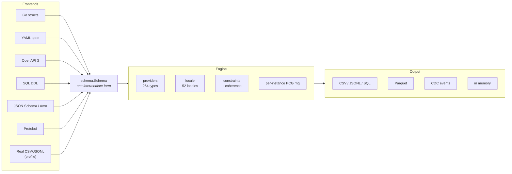

# Synth


**[Docs — bakhod1r.github.io/synth/docs](https://bakhod1r.github.io/synth/docs/)**
· **[Demo — bakhod1r.github.io/synth](https://bakhod1r.github.io/synth)** — the
workbench, generator compiled to WebAssembly, nothing uploaded.

**Fakers give you random strings. Synth gives you a dataset that holds together.**

A user's email matches their name. A transaction points at a real account, in that account's currency, with a timestamp after the account was opened. Every card passes Luhn, every IBAN passes its checksum. That's the difference: fakers generate *fields*, Synth generates *records that reference each other* — at millions of rows per run, streamed, in constant memory.

Synth generates *realistic*, locale-aware data — users, payments, transactions, business records — instead of random fake values. It streams millions of records to CSV, JSONL, SQL `INSERT` files, or Parquet with minimal memory usage, and can produce valid request payloads from OpenAPI schemas.

## How it differs from a faker

| | Faker libraries | Synth |
| --- | --- | --- |
| Scope | one field at a time | whole records, with relations between them |
| Consistency | `Name()` and `Email()` are unrelated | email derives from the name, city matches the postcode |
| Validity | random digits | Luhn-valid cards, checksum-valid IBANs, real BIN ranges |
| Volume | build a slice in memory | streamed, constant memory at 100M+ rows |
| Output | strings you wire up yourself | CSV, JSONL, SQL, Parquet, CDC files |
| Schemas | none | generates valid payloads from your OpenAPI spec |

## How it fits together

Every input format becomes the same intermediate schema, so a feature written
once — coherence, constraints, masking — works no matter where the schema came
from. Adding a frontend costs one parser and nothing else.


```mermaid
flowchart LR
  subgraph front["Frontends"]
    direction TB
    A1["Go structs"]
    A2["YAML spec"]
    A3["OpenAPI 3"]
    A4["SQL DDL"]
    A5["JSON Schema / Avro"]
    A6["Protobuf"]
    A7["Real CSV/JSONL<br/>(profile)"]
  end

  IR["schema.Schema<br/><i>one intermediate form</i>"]

  subgraph engine["Engine"]
    direction TB
    E1["providers<br/>264 types"]
    E2["locale<br/>52 locales"]
    E3["constraints<br/>+ coherence"]
    E4["per-instance PCG rng"]
  end

  subgraph out["Output"]
    direction TB
    O1["CSV / JSONL / SQL"]
    O2["Parquet"]
    O3["CDC events"]
    O4["in memory"]
  end

  A1 --> IR
  A2 --> IR
  A3 --> IR
  A4 --> IR
  A5 --> IR
  A6 --> IR
  A7 --> IR
  IR --> engine
  engine --> out
```

## Install

```bash
go get github.com/bakhod1r/synth              # library
go install github.com/bakhod1r/synth/cmd/synth@latest   # CLI
npm install @bakhod1r/synth                   # JavaScript, via WebAssembly
```

## Quick start

Synth is a **pure data provider**: it never connects to a database, never runs
`INSERT`, never reads DDL. You hand it a plain Go struct; it hands you coherent
records — in memory, to a file, or streamed. Loading is a separate tool's job.

```go
package main

import (
	"time"

	"github.com/bakhod1r/synth"
	"github.com/google/uuid"
)

type User struct {
	ID        uuid.UUID `synth:"pk"`
	FirstName string
	Email     string `synth:"email,from=FirstName"` // derived from the name
	Phone     string
	Country   string
	Region    string
	City      string
	Postcode  string // stays coherent with Country/Region/City
	Card      string `synth:"card"` // Luhn-valid HUMO/UZCARD
	CreatedAt time.Time
}

func main() {
	// Tags are optional — untagged fields are inferred from name and type.
	users := synth.Make[User](10_000, synth.WithSeed(42), synth.WithLocale("uz_UZ"))

	synth.WriteCSV("users.csv", users)                       // to a file
	synth.Stream[User](1_000_000).ToJSONL("users.jsonl")     // constant memory
}
```

Or without Go — describe the data in YAML and run the CLI:

```yaml
# users.yaml
name: users
count: 1000
locale: uz_UZ
fields:
  id:      { kind: uuid, pk: true }
  name:    { kind: name }
  email:   { kind: email, from: name }
  status:  { kind: enum, choices: [active, inactive], weights: [0.9, 0.1] }
  balance: { kind: amount, min: 0, max: 1000000, dist: lognormal, mu: 9, sigma: 1.2 }
```

```bash
synth gen -s users.yaml -o users.csv -n 100000 --seed 42   # or -f jsonl | sql | parquet
```

## What it does

Each of these has a page in the [documentation](https://bakhod1r.github.io/synth/docs/).

| | |
| --- | --- |
| [Referential integrity](https://bakhod1r.github.io/synth/docs/guide/referential-integrity/) | child rows point at parents that exist — within a run, across runs, and across `--append` |
| [Temporal causality](https://bakhod1r.github.io/synth/docs/guide/temporal/) | `created → paid → shipped → delivered`, each strictly after the last |
| [Unique columns](https://bakhod1r.github.io/synth/docs/guide/unique/) | tracked distinct values, or `unique=counter` for constant memory at any row count |
| [Format-valid values](https://bakhod1r.github.io/synth/docs/guide/validity/) | Luhn cards, mod-97 IBANs, country check digits, RFC 5322 mail in every script |
| [Catalogue-backed types](https://bakhod1r.github.io/synth/docs/guide/catalogues/) | real numbering plans, 25,000 handsets, the mail providers that own an address |
| [Images](https://bakhod1r.github.io/synth/docs/guide/images/) | avatars, logos and identicons drawn from the row's own text — no network, no fonts |
| [Locales](https://bakhod1r.github.io/synth/docs/guide/locales/) | 52 locales, coherent from country down to postcode and phone prefix |
| [Statistical shape](https://bakhod1r.github.io/synth/docs/guide/statistics/) | lognormal tails, Zipf hot keys, correlated columns, time series |
| [Streaming](https://bakhod1r.github.io/synth/docs/guide/streaming/) | 100M rows in the memory of 1K, byte-identical under a seed |
| [Outputs](https://bakhod1r.github.io/synth/docs/guide/outputs/) | CSV, JSONL, SQL, Parquet, Postgres `COPY` with matching DDL, gzip/zstd |
| [Profiling](https://bakhod1r.github.io/synth/docs/tools/profile/) | learn a spec from a real export; identifier columns are never echoed back |
| [Constraint mining](https://bakhod1r.github.io/synth/docs/tools/constraints/) | learn the cross-column invariants a per-column profile cannot see |
| [Verify](https://bakhod1r.github.io/synth/docs/tools/verify/) | audit somebody else's dataset; exit 1 on error, 0 on warnings |
| [Diff](https://bakhod1r.github.io/synth/docs/tools/diff/) | compare two datasets' shape, for CI drift gates |
| [Mask](https://bakhod1r.github.io/synth/docs/tools/mask/) | GDPR-shaped anonymization, k-anonymity, Laplace noise |
| [CDC](https://bakhod1r.github.io/synth/docs/tools/cdc/) | Debezium-shaped change history, soft deletes, cascades |
| [Snapshots](https://bakhod1r.github.io/synth/docs/tools/snapshot/) | the table at any instant, and the log between two — replay is an identity |
| [MCP](https://bakhod1r.github.io/synth/docs/mcp/) | eight tools over stdio, no filesystem and no socket |
| [Workbench](https://bakhod1r.github.io/synth/docs/workbench/) | `synth ui`, loopback-only, no CDN and no telemetry |

## Benchmarks

Apple Silicon (M-series, 8 cores), Go 1.25. The same four fields (name, email,
phone, city), 10,000 rows to CSV — with the hand-written loop the fakers require
included, because leaving it out would compare Synth's whole job against half of
theirs:

| Library | ms/op | B/op | allocs/op |
| --- | --- | --- | --- |
| `go-faker/faker` v4 | 115.0 | 87.8 MB | 1,160,247 |
| `jaswdr/faker` v2 | 63.1 | 46.0 MB | 620,393 |
| **Synth** | **25.5** | **11.0 MB** | **320,051** |
| **Synth, streamed** | **20.4** | **9.1 MB** | **300,036** |

The streamed row is the one that matters at scale: its footprint does not grow
with the row count. Full numbers, per-field and struct-filling comparisons, and
how to reproduce them:
[Benchmarks](https://bakhod1r.github.io/synth/docs/reference/benchmarks/).

## Versioning and stability

Synth follows [semantic versioning](https://semver.org). The public API is
frozen at `v1`: a breaking change means `v2`, and in Go `v2` is a different
import path — so nothing that would break your build can arrive by accident.
See [CHANGELOG.md](CHANGELOG.md).

What is already enforced rather than promised:

| | |
| --- | --- |
| Tests | 380+, race-clean, on every push |
| Fuzzing | six parser targets, nightly |
| Core dependencies | exactly two, and CI fails if that slips |
| Boundaries | no database, no network, no files from MCP — each with a test |

Network sinks (Kafka, Postgres) are intentionally **out of scope** — Synth stays
a pure provider; feed its output to your own loader. The rest of the roadmap:
[Status and roadmap](https://bakhod1r.github.io/synth/docs/reference/roadmap/).

## Contributing

[CONTRIBUTING.md](CONTRIBUTING.md) · [SECURITY.md](SECURITY.md) ·
[CODE_OF_CONDUCT.md](CODE_OF_CONDUCT.md)

The documentation site is built with MkDocs from [docs/](docs):

```bash
pip install -r docs/requirements.txt
mkdocs serve               # preview at http://127.0.0.1:8000
scripts/build-pages.sh     # workbench + docs, exactly as CI builds them
```

## License

MIT — see [LICENSE](LICENSE).
