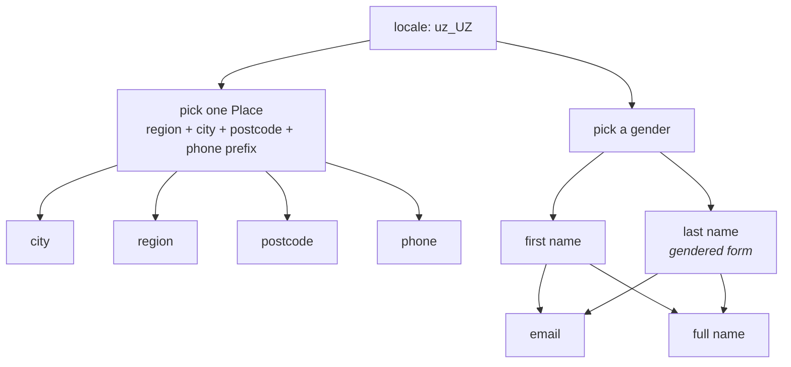

# Locale coherence

Locale isn't just a name list. Pick `uz_UZ` and you get Uzbek names, `+998`
phone numbers, Tashkent districts, UZS amounts, and postcodes that match the
city they're attached to — consistently across every field of the record.

One struct, one seed, three locales — name, phone, card and the nested address
all move together
([examples/localize](https://github.com/bakhod1r/synth/tree/main/examples/localize)):


## Names

All 52 locales carry at least **1000 distinct full-name combinations per
gender**, drawn from real names in the language's own script. Male and female
lists are kept apart, and where surnames inflect for gender the correct form is
used: Novák/Nováková, Иванов/Иванова, Bērziņš/Bērziņa, Abdullayev/Abdullayeva.

Tests enforce the cardinality, the script and the inflection — each is the kind
of error that is invisible to a reader who does not speak the language and
glaring to one who does.

## Catalog datasets

Ten locales also carry their own **catalog** datasets — weekdays, months,
seasons, weather, colours, dishes, fruit, vegetables, drinks and animals — in
the local language, and with local content rather than translations: `uz_UZ`
returns osh and somsa, `pl_PL` returns pierogi and żurek. Types with no dataset
for the chosen locale fall back to English rather than returning nothing.

That fallback is stated, not hidden. `providers.LocalesFor(kind)` reports
exactly which locales a type has data for, the [workbench](../workbench.md)
shows it on every type in the palette, and a test asserts that a type like
`superhero` — the same word everywhere — never claims coverage it does not have.

## Stepping out of the locale

A single column can step out with `localize=false`, without dragging the rest of
the dataset back to English with it:

```go
type Order struct {
    Customer string `synth:"name"`                     // Uzbek
    City     string `synth:"city"`                      // Tashkent district
    Category string `synth:"productcategory,localize=false"` // English, for the partner's system
}
```

The switch only bites on kinds a locale actually reaches — names, addresses,
phone, currency, national IDs, and the catalog types with per-locale data.
`providers.Localizable(kind)` answers whether a kind is one of them, and
`providers.LocalizableKinds()` lists them all; on anything else `localize=` is a
no-op because there was never anything locale-specific to turn off. A
de-localized address field still agrees with its de-localized neighbours: they
share one `en_US` place, so the city still matches the postcode.

## A locale per column

The same lever pointed somewhere other than English — a Japanese phone number on
an Uzbek customer, a German shipping city on a Turkish order:

```go
type Order struct {
    Customer string `synth:"name"`                 // Uzbek
    Phone    string `synth:"phone,locale=ja_JP"`   // +81…
    ShipCity string `synth:"city,locale=de_DE"`    // Berlin
}
```

```yaml
fields:
  customer: {kind: name}
  phone:    {kind: phone, locale: ja_JP}
```

`locale=` wins over `localize=` when both are set — naming a locale is the more
specific instruction. An unknown name is a compile error rather than a silent
fall back to English, because a typo that quietly changes a column's language is
the failure this option exists to prevent.

## Why the fields agree

Within one record the choices are not independent. A single `locale.Place` is
drawn first, and every place-derived field reads from it — which is why the city
matches the postcode instead of merely both being Uzbek.


