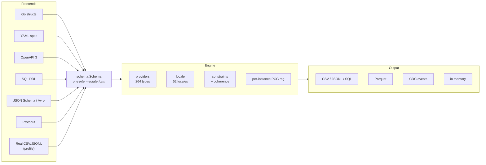

# Synth

**Fakers give you random strings. Synth gives you a dataset that holds together.**

A user's email matches their name. A transaction points at a real account, in
that account's currency, with a timestamp after the account was opened. Every
card passes Luhn, every IBAN passes its checksum. That's the difference: fakers
generate *fields*, Synth generates *records that reference each other* — at
millions of rows per run, streamed, in constant memory.

Synth generates *realistic*, locale-aware data — users, payments, transactions,
business records — instead of random fake values. It streams millions of records
to CSV, JSONL, SQL `INSERT` files, or Parquet with minimal memory usage, and can
produce valid request payloads from OpenAPI schemas.

[Try the workbench](../){ .md-button .md-button--primary }
[Quick start](getting-started/quickstart.md){ .md-button }

## How it differs from a faker

| | Faker libraries | Synth |
| --- | --- | --- |
| Scope | one field at a time | whole records, with relations between them |
| Consistency | `Name()` and `Email()` are unrelated | email derives from the name, city matches the postcode |
| Validity | random digits | Luhn-valid cards, checksum-valid IBANs, real BIN ranges |
| Volume | build a slice in memory | streamed, constant memory at 100M+ rows |
| Output | strings you wire up yourself | CSV, JSONL, SQL, Parquet, CDC files |
| Schemas | none | generates valid payloads from your OpenAPI spec |

## How it fits together

Every input format becomes the same intermediate schema, so a feature written
once — coherence, constraints, masking — works no matter where the schema came
from. Adding a frontend costs one parser and nothing else.

## What Synth will not do

Synth is a **pure data provider**: it never connects to a database, never runs
`INSERT`, never opens a network socket. Every subcommand reads and writes
**files**. Handing the file to your loader is the last step, and it is yours.

That boundary is enforced by tests, not by a promise — see
[Versioning and stability](reference/versioning.md).

## Where to go next

- **[Install](getting-started/install.md)** — Go library, CLI, or npm via WebAssembly.
- **[Quick start](getting-started/quickstart.md)** — a struct in, coherent records out.
- **[CLI and YAML specs](getting-started/cli.md)** — generate without writing Go.
- **[Referential integrity](guide/referential-integrity.md)** — foreign keys that resolve.
- **[Locales](guide/locales.md)** — 52 locales that stay coherent across the record.
- **[Benchmarks](reference/benchmarks.md)** — measured against the fakers.

## License

MIT — see [LICENSE](https://github.com/bakhod1r/synth/blob/main/LICENSE).
