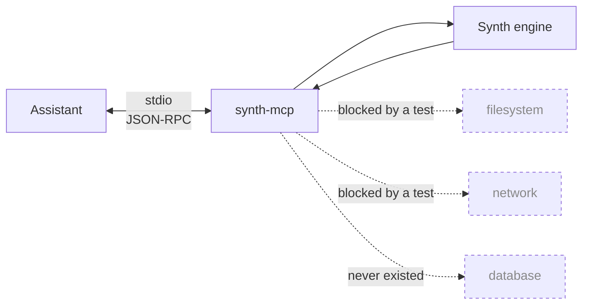

# MCP

Synth speaks MCP, so an assistant can generate and check data without shelling
out to the CLI:

```bash
go install github.com/bakhod1r/synth/mcp/cmd/synth-mcp@latest
claude mcp add synth -- synth-mcp
```

Eight tools: `generate`, `list_types`, `list_presets`, `verify`, `profile`,
`mask`, `snapshot`, `diff`.

## Why it takes arguments, not paths

The server is stdio-only and takes every input as an argument rather than a
path — it opens no socket and reads no file, and a test forbids the imports that
would let it. An MCP server runs with your permissions on behalf of a model that
may be reading text someone else wrote, so a path argument would turn a data
generator into a file-reading primitive.



Data goes in as an argument and comes back in the response. Nothing else moves.

## A separate module

`mcp-go` brings 20 transitive dependencies, kept out of the core module's graph.

Full detail:
[mcp/README.md](https://github.com/bakhod1r/synth/blob/main/mcp/README.md).
