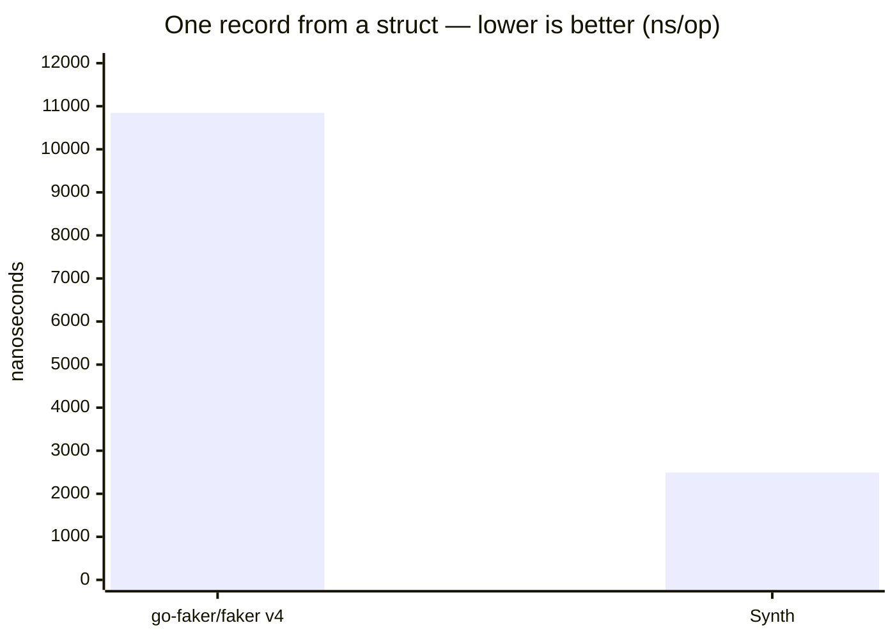
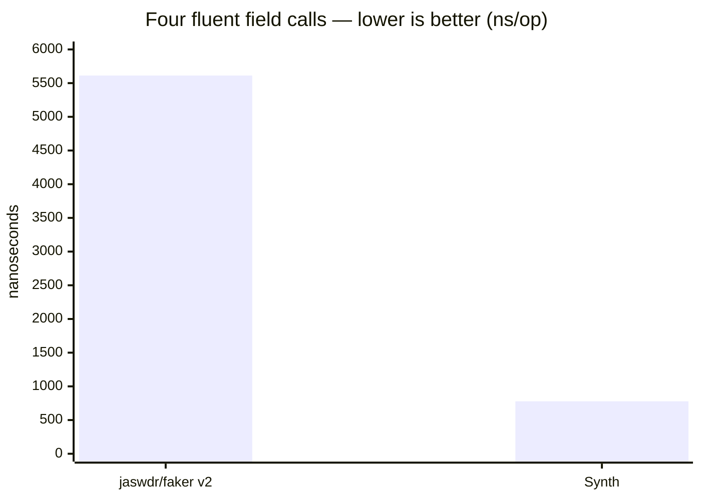
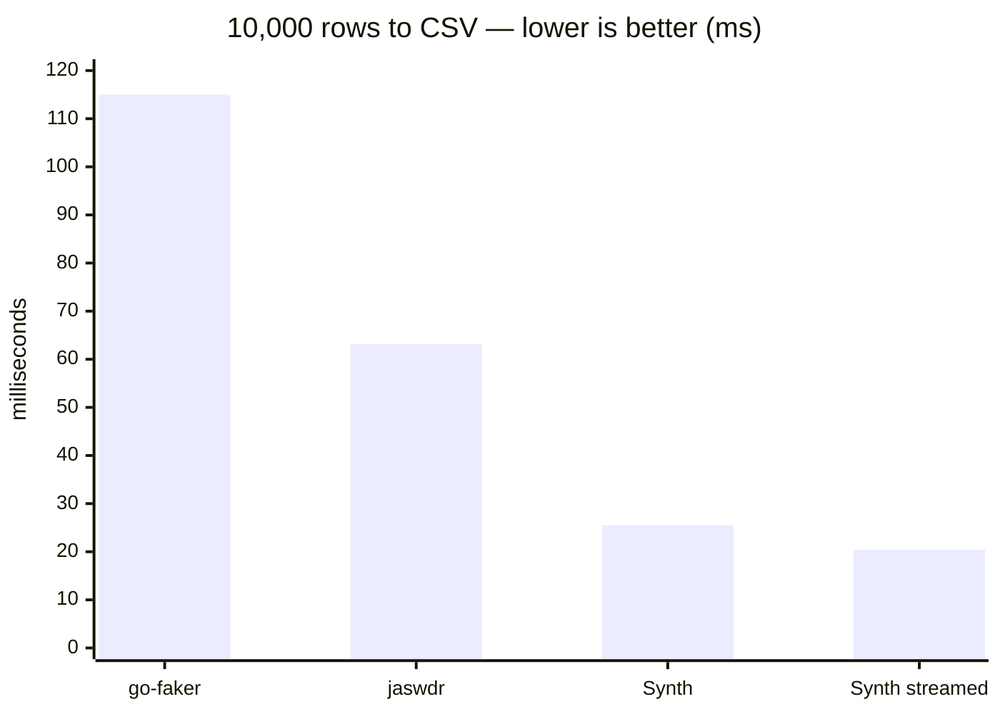
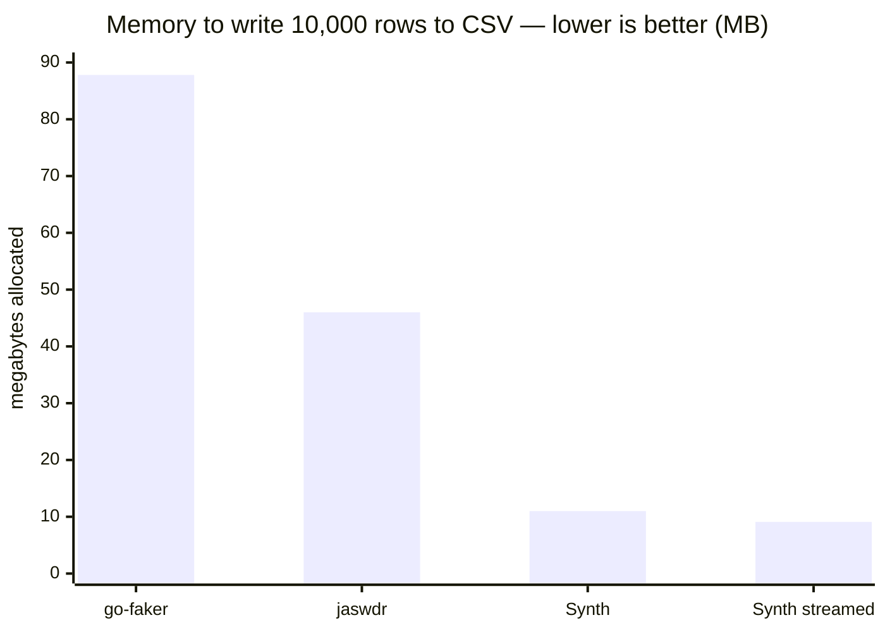
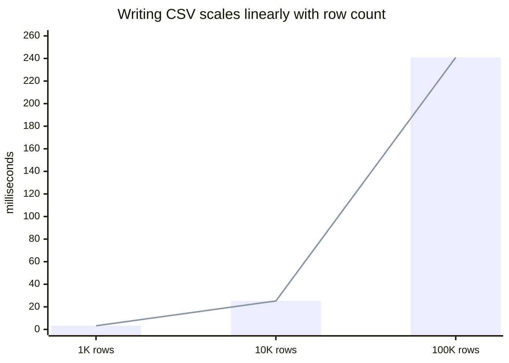

# Benchmarks

Measured on Apple Silicon (M-series, 8 cores), Go 1.25,
`go test -bench -benchmem`. Each library fills the same four fields (name,
email, phone, city).

## Struct filling

One record from a struct definition:

| Library | ns/op | B/op | allocs/op |
| --- | --- | --- | --- |
| `go-faker/faker` v4 | 10,848 | 8,778 | 116 |
| **Synth** | **2,494** | **2,001** | **34** |



## Per-field calls

The fluent API:

| Library | ns/op | B/op | allocs/op |
| --- | --- | --- | --- |
| `jaswdr/faker` v2 | 5,612 | 4,533 | 61 |
| **Synth** | **778** | **222** | **14** |



## Batch generation

Synth's normal mode, where schema work is done once for the whole run: 1,678
ns/record (~596K records/sec single-threaded), and ~1.28M records/sec across 8
cores with `MakeParallel`.

## Writing a file

10,000 rows to disk, the same four fields. This is what the libraries are
actually used for, and it is where the comparison changes shape: go-faker and
jaswdr generate values and stop, so their users write the loop by hand. That
loop is included below, because leaving it out would compare Synth's whole job
against half of theirs.

| Library | Format | ms/op | B/op | allocs/op |
| --- | --- | --- | --- | --- |
| `go-faker/faker` v4 | CSV (hand-written loop) | 115.0 | 87.8 MB | 1,160,247 |
| `jaswdr/faker` v2 | CSV (hand-written loop) | 63.1 | 46.0 MB | 620,393 |
| **Synth** | **CSV** | **25.5** | **11.0 MB** | **320,051** |
| **Synth** | **CSV, streamed** | **20.4** | **9.1 MB** | **300,036** |
| `jaswdr/faker` v2 | JSONL (hand-written loop) | 96.4 | 46.7 MB | 627,708 |
| **Synth** | **JSONL** | **50.1** | **9.6 MB** | **270,060** |
| **Synth** | **SQL INSERT** | **57.2** | **13.1 MB** | **400,058** |



Allocation is the wider gap, and the one that decides whether a run finishes:



The streamed row is the one that matters at scale: it never holds the rows in
memory, so its footprint does not grow with the row count. At ten thousand rows
the gap is small; the same code writes ten million.

## Scaling

Writing scales linearly — 1K/10K/100K rows take 3.2 ms, 25.2 ms and 240.9 ms:



```
BenchmarkSynth_WriteCSVScaling/1000        3,204,250 ns/op     1.1 MB/op
BenchmarkSynth_WriteCSVScaling/10000      25,161,486 ns/op    11.0 MB/op
BenchmarkSynth_WriteCSVScaling/100000    240,948,389 ns/op   109.8 MB/op
```

## A note on presets

`synth gen --preset user` generates about 5,000 rows/sec, which looks slow next
to the numbers above. 96% of that time is one column — `password_hash` runs
PBKDF2 at 1,000 iterations, which is a key derivation function and is meant to
be expensive. The same shape without it runs at roughly 500,000 rows/sec.

## Reproducing

```sh
cd benchcmp && go test -bench=. -benchmem -run=^$ .
```

The comparison lives in its own module, so the competing fakers never enter this
library's dependency graph.

Per-instance RNG means no global-`rand` mutex — parallel generation scales, and
same-seed output is byte-identical regardless of worker count.
