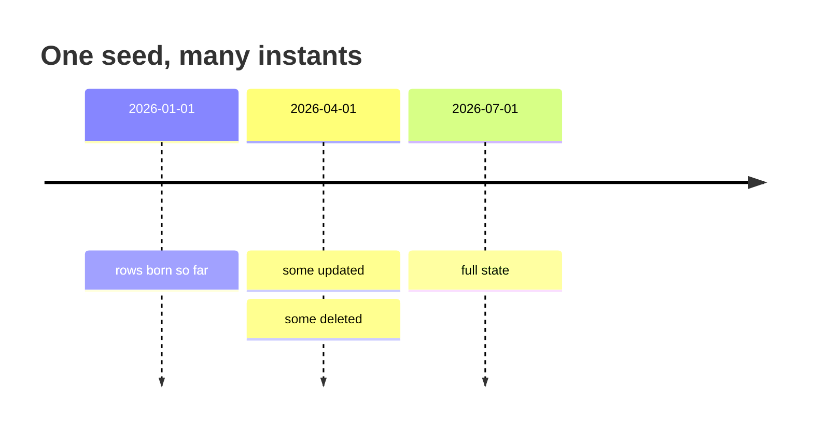

# Time travel (snapshots)



One seed already fixes a whole dataset. Snapshots make *time* another axis of
that determinism: ask for the table as it stood at any instant, or for what
changed between two.

```bash
synth snapshot -s orders.yaml --at 2026-01-01 -o jan.csv
synth snapshot -s orders.yaml --at 2026-07-01 -o jul.csv
synth snapshot -s orders.yaml --from 2026-01-01 --to 2026-07-01 -o changes.jsonl
```

```go
tl, _ := synth.Snapshot[Order](synth.SnapshotConfig{Rows: 100_000, Churn: 2, DeleteFrac: 0.1})
jan := tl.At(jan1)
jul := tl.At(jul1)
events := tl.Between(jan1, jul1)

tl.Apply(jan, events)   // == jul, exactly
```

That last line is the contract, and it is the point: replaying the log over the
earlier snapshot reproduces the later one. Migration and incremental-ETL tests
need a source of truth on both ends *and* the diff between them, and here all
three come from one seed.

## Why it holds

The equivalence holds by construction rather than by luck. Each row's whole
life — when it was born, when it changed, whether it was deleted — is derived
from its index, and `At` and `Between` read that same life. Nothing is simulated
forward, so a snapshot a century out costs no more than one an hour out.
Consecutive ranges tile exactly, so you can walk a timeline in steps and land on
the same state as one jump.

## Instants

`--at`, `--from` and `--to` take `2026-01-01` or full RFC 3339. `--churn` is the
mean number of updates per row over the window.
